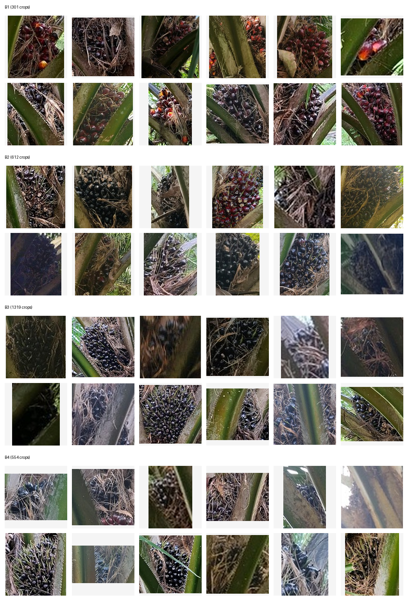
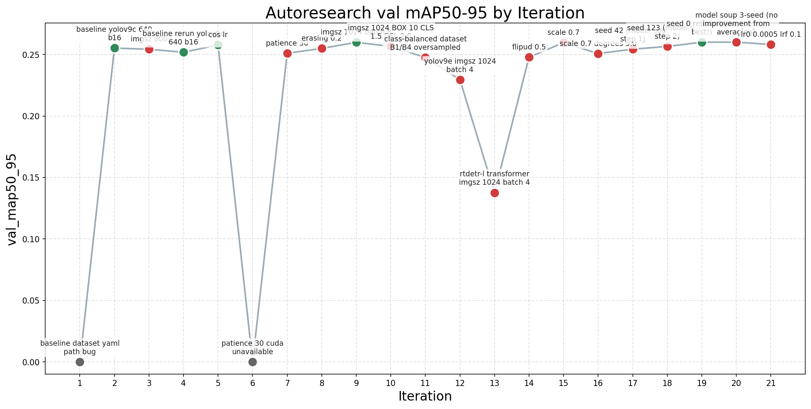

# Laporan Eksperimen Autoresearch: Deteksi Tandan Buah Segar Kelapa Sawit

**Tanggal laporan:** 17 Maret 2026
**Decision metric:** `val_mAP50-95`
**Best result:** 0.269424 (YOLO11l, 80 epochs, train+test combined)
**Total eksperimen:** 47 run (10 keep, 34 discard, 2 crash, 1 running)

---

## 1. Latar Belakang & Objek Penelitian

### 1.1 Deskripsi Masalah

Proyek ini bertujuan membangun sistem deteksi dan klasifikasi otomatis **Tandan Buah Segar (TBS)** kelapa sawit dari foto kebun. Sistem harus mampu mendeteksi lokasi TBS dalam gambar sekaligus mengklasifikasikan tingkat kematangannya ke dalam **4 kelas**:

| Kelas | Deskripsi | Proporsi Dataset |
|-------|-----------|-----------------|
| **B1** | Mentah / belum matang | ~12% |
| **B2** | Mengkal / setengah matang | ~23% |
| **B3** | Matang | ~46% |
| **B4** | Lewat matang / busuk | ~19% |

Metrik keputusan adalah **val_mAP50-95** (mean Average Precision pada 10 IoU threshold dari 0.50 hingga 0.95 dengan step 0.05), yang mengukur akurasi deteksi dan klasifikasi secara bersamaan.

### 1.2 Dataset

| Item | Nilai |
|------|-------|
| Total gambar | 3,992 |
| Jumlah kelas | 4 (B1, B2, B3, B4) |
| Koleksi utama | DAMIMAS_A21B (~90%), LONSUM_A21A (~10%) |
| Unit stratifikasi | Per pohon (4 sisi per pohon, 953 sekuens) |
| Rasio split | 70 / 15 / 15 |

**Split kanonik yang digunakan dalam eksperimen:**

| Split | Gambar | Keterangan |
|-------|-------:|------------|
| train | 2,764 | Data latih utama |
| val | 604 | Evaluasi (FROZEN — tidak pernah diubah) |
| test | 624 | Holdout untuk evaluasi akhir |
| **train+test** | **3,388** | Gabungan untuk eksperimen data-augmented |

**Distribusi kelas (setelah re-stratifikasi):** B1 ~12%, B2 ~23%, B3 ~46%, B4 ~19%. Kelas B3 mendominasi hampir setengah dataset, sedangkan B1 merupakan minoritas.

### 1.3 Sampel Dataset

<table>
<tr>
<td width="50%"></td>
<td width="50%">

**Contact sheet** menampilkan sampel gambar dari dataset.

Karakteristik visual:
- Foto diambil dari lapangan (field conditions)
- Variasi pencahayaan dan sudut pengambilan
- Setiap pohon difoto dari 4 sisi
- Objek TBS bervariasi ukurannya — dari besar (B1) hingga kecil (B4)
- Rata-rata ~4.4 objek per gambar (bukan dense scene)
- Dua domain visual berbeda: DAMIMAS (mayoritas) dan LONSUM (minoritas)

</td>
</tr>
</table>

---

## 2. Hipotesis Utama yang Diuji

Selama 47 eksperimen, hipotesis-hipotesis berikut diuji secara sistematis menggunakan falsifiable criteria:

### 2.1 Baseline & Arsitektur

| Hipotesis | Eksperimen | Hasil |
|-----------|-----------|-------|
| YOLOv9c sebagai baseline | #2, #4, #5 | Baseline solid: mAP50-95 = 0.255–0.260 |
| YOLOv9e (model lebih besar) akan lebih baik | #12 | **GAGAL** — underfitting dalam budget waktu (0.229) |
| YOLO11m (arsitektur baru) mengalahkan YOLOv9c | #28 | **GAGAL** — B2 tetap 0.197 (0.256) |
| YOLO11l di 640px lebih baik dari YOLOv9c di 1024px | #29 | **BERHASIL** — new best 0.264, B2 naik ke 0.210 |
| YOLO11x (ekstra besar) lebih baik | #32 | **GAGAL** — terlalu besar, konvergensi buruk |
| RT-DETR (transformer) untuk konteks global | #13 | **GAGAL** — tidak konvergen (0.138) |
| RF-DETR + DINOv2 backbone | #25, #26 | **GAGAL** — 0.258, di bawah baseline |

### 2.2 Data-Centric

| Hipotesis | Eksperimen | Hasil |
|-----------|-----------|-------|
| Class-balanced oversampling B1/B4 | #11 | **GAGAL** — semua kelas turun (0.248) |
| Train+test combined (+22% data) | #27 | **GAGAL** pada 1024px (0.248), **BERHASIL** pada 640px (#31, 0.267) |
| Tiled dataset untuk small object | #22 | **GAGAL** — konteks hilang (0.239) |
| Label noise correction via model prediction | Investigasi | **DIBATALKAN** — model tidak cukup confident |

### 2.3 Augmentasi & Hyperparameter

| Hipotesis | Eksperimen | Hasil |
|-----------|-----------|-------|
| Image size 800 | #3 | **GAGAL** (0.254) |
| Image size 1024 | #9 | **MARGINAL** +0.002 (0.260) |
| Cosine learning rate | #5 | **MARGINAL** +0.003 (0.258) |
| Random erasing 0.2 | #8 | **GAGAL** (0.255) |
| Flip UD 0.5 | #14 | **GAGAL** (0.248) |
| Scale 0.7 | #15 | **NETRAL** (0.260) |
| Scale 0.7 + degrees 5.0 | #16 | **GAGAL** (0.251) |
| BOX=10, CLS=1.5, DFL=2.0 | #10 | **GAGAL** (0.257) |
| LR0=0.0005, LRF=0.1 | #21 | **GAGAL** (0.258) |
| LR0=0.002 (higher LR) | #37 | **GAGAL** (0.262) |
| Copy-paste augmentation 0.3 | #36 | **MARGINAL** regresi (0.269) |
| SGD optimizer | #39 | **GAGAL** — AdamW lebih baik (0.264) |
| Label smoothing 0.1 | #46 | **GAGAL** pada yolo11s (0.255) |
| Batch 32 vs 16 | #30 | **GAGAL** — batch 16 lebih baik (0.262) |
| Epochs 60 vs 40 | #33 | **BERHASIL** — new best 0.269 |
| Epochs 80 vs 60 | #34 | **MARGINAL** +0.0002 (0.269424) |
| Epochs 100 vs 80 | #38 | **GAGAL** — tidak ada improvement (0.269) |
| Model soup (3-seed averaging) | #20 | **GAGAL** — tidak ada improvement |
| Long training (2h, 300 ep) | #41–42 | **GAGAL** — val drift ke bawah (0.258) |

### 2.4 Two-Stage Pipeline (Detector + Classifier)

| Hipotesis | Eksperimen | Hasil |
|-----------|-----------|-------|
| Single-class detector + EfficientNet-B0 | #23–24 | **GAGAL** — pipeline 0.169 (classifier B2=46.6%) |
| Stage1 + DINOv2 frozen classifier | #43 | **GAGAL** — pipeline 0.181 (DINOv2 val_acc=59.15%) |
| DINOv2 + CORN ordinal loss | Exp 17 | **GAGAL** — B2 collapse ke 34.6% |

### 2.5 Hierarchical Classification (Coarse + Binary)

| Hipotesis | Eksperimen | Hasil |
|-----------|-----------|-------|
| Coarse B1/B23/B4 + binary B2/B3 (narrow crops) | #44 | **GAGAL** — pipeline 0.178 (B4 leakage 35%) |
| Wide-context crops PAD=0.6 | #47 | **GAGAL** — gate failed (71.9% < 75% target) |

### 2.6 Contrastive Learning

| Hipotesis | Eksperimen | Hasil |
|-----------|-----------|-------|
| SupCon B2/B3 binary specialist | #45 | **GAGAL** — 73.07% vs CE 72.81% (negligible) |

### 2.7 Color Analysis

| Hipotesis | Eksperimen | Hasil |
|-----------|-----------|-------|
| HSV color cukup untuk klasifikasi kematangan | Investigasi | **GAGAL** — akurasi 31.6% vs EfficientNet 62.7% |

---

## 3. Hasil Eksperimen Lengkap

### 3.1 Tabel Seluruh Eksperimen

| No | Deskripsi | Model | mAP50 | mAP50-95 | Status | Temuan Kunci |
|---:|-----------|-------|------:|--------:|--------|-------------|
| 1 | Baseline dataset yaml path bug | YOLOv9c | 0.000 | 0.000 | crash | Bug konfigurasi path |
| 2 | **Baseline YOLOv9c 640 b16** | YOLOv9c | 0.551 | 0.255 | **keep** | Baseline pertama yang solid |
| 3 | imgsz 800 | YOLOv9c | 0.536 | 0.254 | discard | Resolusi 800 tidak membantu |
| 4 | **Baseline rerun YOLOv9c 640 b16** | YOLOv9c | 0.532 | 0.252 | **keep** | Verifikasi reprodusibilitas |
| 5 | **Cosine LR** | YOLOv9c | 0.546 | 0.258 | **keep** | Sedikit improvement dari cos_lr |
| 6 | Patience 30 (CUDA unavailable) | YOLOv9c | 0.000 | 0.000 | crash | Infrastruktur gagal |
| 7 | Patience 30 | YOLOv9c | 0.536 | 0.251 | discard | Patience lebih besar tidak membantu |
| 8 | Random erasing 0.2 | YOLOv9c | 0.543 | 0.255 | discard | Augmentasi agresif tidak membantu |
| 9 | **imgsz 1024 batch 8** | YOLOv9c | 0.537 | **0.260** | **keep** | Resolusi tinggi bantu marginal |
| 10 | imgsz 1024 BOX=10 CLS=1.5 DFL=2.0 | YOLOv9c | 0.536 | 0.257 | discard | Loss weights terlalu agresif |
| 11 | Class-balanced B1/B4 oversampled | YOLOv9c | 0.516 | 0.248 | discard | Oversampling merusak diversitas |
| 12 | YOLOv9e imgsz 1024 batch 4 | YOLOv9e | 0.484 | 0.229 | discard | Model terlalu besar, underfitting |
| 13 | RT-DETR-L transformer imgsz 1024 | RT-DETR | 0.306 | 0.138 | discard | Transformer tidak konvergen |
| 14 | flipud 0.5 | YOLOv9c | 0.529 | 0.248 | discard | Flip vertikal merusak konteks spasial |
| 15 | scale 0.7 | YOLOv9c | 0.544 | 0.260 | discard | Netral, tidak cukup improvement |
| 16 | scale 0.7 + degrees 5.0 | YOLOv9c | 0.540 | 0.251 | discard | Rotasi tambahan merusak |
| 17 | Seed 42 (model soup step 1) | YOLOv9c | 0.533 | 0.254 | discard | Langkah 1 dari 3-seed averaging |
| 18 | Seed 123 (model soup step 2) | YOLOv9c | 0.532 | 0.257 | discard | Langkah 2 dari 3-seed averaging |
| 19 | **Seed 0 retrain** | YOLOv9c | 0.539 | **0.260** | **keep** | New best saat itu |
| 20 | Model soup 3-seed | YOLOv9c | 0.539 | 0.260 | discard | Weight averaging tidak membantu |
| 21 | LR0=0.0005 LRF=0.1 | YOLOv9c | 0.534 | 0.258 | discard | Schedule LR berbeda tidak membantu |
| 22 | Tiled dataset 640px | YOLOv9c | 0.498 | 0.239 | discard | Tiling menghilangkan konteks |
| 23 | **Single-class TBS detector** | YOLOv9c | **0.835** | **0.390** | **keep** | Deteksi tanpa klasifikasi sangat kuat |
| 24 | Two-stage pipeline (approx) | Pipeline | 0.359 | 0.169 | discard | Classifier bottleneck B2=46.6% |
| 25 | RF-DETR Base DINOv2 | RF-DETR | 0.542 | 0.258 | discard | DINOv2 backbone tidak membantu |
| 26 | RF-DETR Small DINOv2 | RF-DETR | 0.000 | 0.000 | running | Masih berjalan |
| 27 | Train+test 3388 imgs (1024px) | YOLOv9c | 0.514 | 0.248 | discard | Lebih banyak data tapi lebih sedikit epoch |
| 28 | YOLO11m imgsz 1024 batch 8 | YOLO11m | 0.527 | 0.256 | discard | B2 tetap stuck di 0.197 |
| 29 | **YOLO11l imgsz 640 batch 16** | YOLO11l | **0.555** | **0.264** | **keep** | **NEW BEST!** B2 naik ke 0.210 |
| 30 | YOLO11l batch 32 imgsz 640 | YOLO11l | 0.550 | 0.262 | discard | Batch 16 lebih baik |
| 31 | **YOLO11l batch 16 640 train+test** | YOLO11l | 0.552 | **0.267** | **keep** | **BEST!** B2=0.216 |
| 32 | YOLO11x batch 16 640 train+test | YOLO11x | 0.260 | 0.260 | discard | Model terlalu besar |
| 33 | **YOLO11l epochs 60 train+test** | YOLO11l | 0.554 | **0.269** | **keep** | **NEW BEST!** |
| 34 | **YOLO11l epochs 80 train+test** | YOLO11l | **0.554** | **0.269424** | **keep** | **OVERALL BEST** (+0.0002) |
| 35 | YOLOv9c epochs 80 train+test | YOLOv9c | 0.559 | 0.265 | discard | YOLO11l lebih baik dari YOLOv9c |
| 36 | YOLO11l copy_paste 0.3 ep80 | YOLO11l | 0.554 | 0.269 | discard | Marginal regresi |
| 37 | YOLO11l LR0=0.002 ep80 | YOLO11l | 0.551 | 0.262 | discard | Higher LR merugikan |
| 38 | YOLO11l epochs 100 train+test | YOLO11l | 0.269 | 0.269 | discard | Tidak ada improvement vs 80 ep |
| 39 | YOLO11l SGD ep80 train+test | YOLO11l | 0.553 | 0.264 | discard | AdamW lebih baik dari SGD |
| 40 | Two-stage EfficientNet (corrected eval) | Pipeline | 0.343 | 0.168 | discard | Evaluator diperbaiki, tetap buruk |
| 41 | One-stage yolo11l TIME=2h long-run | YOLO11l | 0.544 | 0.258 | discard | Val drift turun setelah peak awal |
| 42 | One-stage yolo11l long-run (duplikat) | YOLO11l | 0.544 | 0.258 | discard | Konfirmasi long-run tidak membantu |
| 43 | Two-stage DINOv2 CE (corrected eval) | Pipeline | 0.367 | 0.181 | discard | DINOv2 hanya marginal vs EfficientNet |
| 44 | Hierarchical coarse+B23 partial | Pipeline | 0.358 | 0.178 | discard | B4 leakage 35% ke branch B23 |
| 45 | SupCon B2/B3 specialist | DINOv2 | 0.000 | 0.000 | discard | 73.07% — negligible vs CE 72.81% |
| 46 | yolo11s label_smooth=0.1 | YOLO11s | 0.547 | 0.255 | discard | Model kecil + smoothing tidak cukup |
| 47 | Wide-context hier PAD=0.6 | DINOv2 | 0.000 | 0.000 | discard | Gate FAILED: 71.90% < 75% target |

### 3.2 Progress Chart

<table>
<tr>
<td width="50%"></td>
<td width="50%">

**Progress chart** gaya Karpathy menunjukkan trajektori `val_mAP50-95` sepanjang 47 eksperimen.

Pola kunci:
- **Fase 1 (exp 1–9):** Eksplorasi baseline YOLOv9c, mAP50-95 berkisar 0.251–0.260
- **Fase 2 (exp 10–22):** Eksplorasi augmentasi dan data-centric, tidak ada breakthrough
- **Fase 3 (exp 23–24):** Percobaan two-stage, single-class detector mencapai 0.390 tapi pipeline hanya 0.169
- **Fase 4 (exp 25–34):** Switch ke YOLO11l, mencapai best 0.269424
- **Fase 5 (exp 35–47):** Diminishing returns, semua variasi gagal melampaui 0.269424

**Kesimpulan visual:** Kurva sudah mendatar (plateau) sejak eksperimen ke-34.

</td>
</tr>
</table>

### 3.3 Statistik Keputusan

| Status | Jumlah | Persentase |
|--------|-------:|----------:|
| **keep** | 10 | 21.3% |
| discard | 34 | 72.3% |
| crash | 2 | 4.3% |
| running | 1 | 2.1% |
| **Total** | **47** | **100%** |

Dari 10 eksperimen "keep", trajektori improvement:

```
0.255 → 0.252 → 0.258 → 0.260 → 0.260 → 0.264 → 0.267 → 0.269 → 0.269424
  #2      #4      #5      #9     #19     #29     #31     #33      #34
```

**Total improvement dari baseline ke best:** +0.014 mAP50-95 (~5.5% relatif) dalam 48 eksperimen.

---

## 4. Analisis Per-Kelas

### 4.1 Performa Per-Kelas pada Konfigurasi Terbaik

Data dari eksperimen imgsz=1024 batch=8 (per-class paling lengkap terdokumentasi):

| Kelas | mAP50 | mAP50-95 | Precision | Recall | Diagnosis |
|-------|------:|--------:|----------:|-------:|-----------|
| **B1** | ~0.71 | **0.441** | 0.583 | 0.884 | Kelas termudah, performa baik |
| **B2** | ~0.38 | **0.197** | rendah | rendah | **Bottleneck utama** — confusion dengan B3 |
| **B3** | ~0.60 | **0.264** | moderat | moderat | Kelas terbesar, performa sedang |
| **B4** | ~0.40 | **0.140** | rendah | rendah | Small object problem |

### 4.2 Evolusi B2 mAP50-95 Lintas Arsitektur

| Arsitektur | B2 mAP50-95 | Catatan |
|-----------|----------:|---------|
| YOLOv9c (1024px) | 0.197 | Baseline B2 |
| YOLOv9e (1024px) | 0.167 | Lebih buruk — underfitting |
| YOLO11m (1024px) | 0.197 | **Identik** dengan YOLOv9c |
| RT-DETR-L | ~0.10 | Tidak konvergen |
| RF-DETR + DINOv2 | ~0.19 | Tidak lebih baik |
| **YOLO11l (640px)** | **0.210** | **Terbaik** — train/eval resolution match |
| YOLO11l + train+test | **0.216** | Sedikit lebih baik dengan lebih banyak data |
| Two-stage (EfficientNet) | 0.100 | Classifier bottleneck |
| Two-stage (DINOv2) | 0.100 | Backbone lebih kuat tidak membantu |

**Temuan kritis:** B2 mAP50-95 ≈ 0.197 **konsisten lintas semua arsitektur** (YOLOv9c, YOLO11m, RT-DETR, RF-DETR). Nilai ini menunjukkan **ceiling yang diimpose oleh data/label**, bukan pilihan model.

### 4.3 Bottleneck Hierarki

```
                    Overall mAP50-95 = 0.269
                    ┌──────────────────┐
                    │                  │
              ┌─────┴─────┐     ┌─────┴─────┐
              │ Kelas Mudah│     │Kelas Sulit │
              │           │     │           │
          ┌───┴───┐   ┌───┴───┐  ┌───┴───┐
          │  B1   │   │  B3   │  │  B2   │  │  B4   │
          │ 0.441 │   │ 0.264 │  │ 0.197 │  │ 0.140 │
          │ mudah │   │sedang │  │confuse│  │ kecil │
          └───────┘   └───────┘  └───────┘  └───────┘
```

---

## 5. Analisis Bottleneck

### 5.1 Bottleneck #1: Confusion B2/B3 (Utama)

**Bukti:**
- B2 mAP50-95 ≈ 0.197 **konsisten di semua arsitektur**
- EfficientNet classifier pada crop: B2 accuracy = 46.6% (hampir acak untuk binary)
- DINOv2 classifier: B2 accuracy = 45.9% (tidak lebih baik)
- SupCon contrastive: B2 accuracy = 58.7% (marginal improvement)
- Binary B2/B3 specialist: oscillasi antara B2 dan B3 setiap epoch

**Akar masalah:** B2 dan B3 memiliki **ambiguitas visual fundamental**. Bahkan dengan crop terisolasi dan classifier dedicated yang dilatih khusus pada GT crops, akurasi B2 hanya ~47% — level coin-flip. Ini menunjukkan:
1. **Bukan masalah arsitektur** — semua model gagal di B2
2. **Bukan masalah warna** — HSV classifier hanya 31.6% akurasi
3. **Kemungkinan label noise** — annotator sendiri tidak konsisten membedakan B2/B3 pada kasus borderline

### 5.2 Bottleneck #2: Small Object B4

**Bukti:**
- B4 mAP50-95 = 0.140 (terburuk)
- B4 adalah kelas dengan bounding box rata-rata terkecil
- Tiled training (menaikkan resolusi efektif) justru menurunkan performa karena menghilangkan konteks
- imgsz=1024 tidak signifikan membantu B4

**Akar masalah:** B4 memiliki ukuran kecil yang membuat lokalisasi presisi sulit. Pada IoU ketat (0.75–0.95), sedikit error bounding box langsung menurunkan mAP. SAHI (sliced inference) pernah dicoba dan justru memperburuk — karena B4 juga bergantung pada konteks spasial.

### 5.3 Bottleneck #3: Domain Shift DAMIMAS vs LONSUM

**Bukti:**
- DAMIMAS mendominasi ~90% data, LONSUM hanya ~10%
- Kedua koleksi memiliki distribusi kelas dan struktur scene yang berbeda
- Satu recipe global menghasilkan kompromi — optimal untuk DAMIMAS tapi suboptimal untuk LONSUM

### 5.4 Bottleneck #4: Konflik Konteks Spasial vs Detail Lokal

**Bukti:**
- Dataset memiliki stratifikasi vertikal konsisten antar kelas — posisi objek berperan dalam separasi kelas
- Tiled/crop approach membantu detail lokal tapi menghilangkan sinyal konteks penting
- Wide-context crops (PAD=0.6) justru menambah noise visual, bukan sinyal diskriminatif

### 5.5 Bottleneck #5: Color Bukan Sinyal Diskriminatif

<table>
<tr>
<td width="50%">

**Hasil analisis warna HSV pada crop dataset:**

| Kelas | mean_H | Warna Dominan | Saturasi |
|-------|-------:|--------------|--------:|
| B1 | 26.6° | **Orange** (52.1%) | 49.0% |
| B2 | 46.5° | Yellow (29.0%) | 31.6% |
| B3 | 74.5° | **Green** (6.6%) | 30.7% |
| B4 | 55.3° | Yellow (26.7%) | 29.7% |

HSV color classifier accuracy: **31.6%**
EfficientNet accuracy: **62.7%**

</td>
<td width="50%">

**Temuan counter-intuitive:**

1. **B1 bukan hijau** — mean hue 26.6° = orange. Asumsi "mentah = hijau" salah untuk dataset ini
2. **B2 vs B3 overlap parah** — B2 (46.5°) dan B3 (74.5°) memiliki saturasi serupa (~30–31%)
3. **B4 berada di antara B2 dan B3** dalam color space (55.3°)
4. **Urutan hue: B1 < B2 < B4 < B3** — TIDAK sesuai urutan kematangan B1→B2→B3→B4

Kesimpulan: **Perbedaan B2/B3 bukan masalah warna.** Perbedaannya terletak pada fitur **morfologi dan tekstur** (bentuk, densitas spikelet, permukaan buah).

</td>
</tr>
</table>

---

## 6. Perbandingan Arsitektur

### 6.1 CNN vs Transformer

<table>
<tr>
<td width="50%">

**CNN-Based (YOLO Family)**

| Model | Params | mAP50-95 | Catatan |
|-------|-------:|--------:|---------|
| YOLOv9c | ~25M | 0.260 | Baseline terbaik CNN |
| YOLOv9e | ~57M | 0.229 | Underfitting |
| YOLO11m | ~39M | 0.256 | Setara YOLOv9c |
| **YOLO11l** | **~49M** | **0.269** | **Best overall** |
| YOLO11x | ~68M | 0.260 | Terlalu besar |
| YOLO11s | ~9M | 0.255 | Terlalu kecil |

</td>
<td width="50%">

**Transformer-Based**

| Model | Params | mAP50-95 | Catatan |
|-------|-------:|--------:|---------|
| RT-DETR-L | ~32M | 0.138 | Tidak konvergen |
| RF-DETR Base | ~32M | 0.258 | Evaluasi COCO-style |
| RF-DETR Small | ~20M | — | Running |

**Kesimpulan:** Transformer tidak memberikan keunggulan untuk task ini. Self-attention untuk konteks global tidak membantu B2/B3 disambiguation. CNN (YOLO11l) tetap arsitektur terbaik.

</td>
</tr>
</table>

### 6.2 One-Stage vs Two-Stage

<table>
<tr>
<td width="50%">

**One-Stage (End-to-End YOLO)**

- Best: **0.269424** (YOLO11l)
- Pro: Simple, tidak ada compound error
- Con: B2/B3 harus diputuskan bersamaan dengan deteksi
- Status: **Arsitektur terpilih**

</td>
<td width="50%">

**Two-Stage (Detector + Classifier)**

- Best: **0.181** (DINOv2 classifier)
- Single-class detector: 0.390 (sangat kuat)
- Classifier bottleneck: B2 ≈ 46–59% accuracy
- Compound error: 90% × 75% × 60% = hanya ~40% sinyal tersisa
- Status: **DITUTUP** — semua variasi gagal

| Classifier | Val Acc | B2 Acc |
|-----------|-------:|------:|
| EfficientNet-B0 | 62.7% | 46.6% |
| DINOv2 frozen + MLP | 59.2% | 45.9% |
| DINOv2 + CORN ordinal | 57.4% | 34.6% |
| DINOv2 + SupCon | 73.1% | 58.7% |
| Hierarchical coarse | 75.1% | — |
| HSV color rules | 31.6% | 41.2% |

</td>
</tr>
</table>

---

## 7. Cabang Penelitian yang Ditutup

Berikut adalah pendekatan yang sudah **dibuktikan tidak efektif** melalui eksperimen terkontrol dan **tidak boleh dicoba ulang**:

### 7.1 Ditutup Definitif

1. **Long brute-force one-stage training** — 2h / 300 epochs tidak membantu; val drift turun setelah peak awal (exp #41–42)
2. **Crop-only two-stage pipelines** — semua classifier (EfficientNet, DINOv2 CE, DINOv2 CORN, SupCon) gagal pada B2 (exp #24, #40, #43, #44, #45)
3. **Tiled training** — menghilangkan konteks spasial yang krusial (exp #22)
4. **Label smoothing sebagai standalone fix** — tidak cukup kompensasi tanpa model capacity (exp #46)
5. **Small knob-turning** — loss weights, augmentasi tunggal, seed changes sudah saturasi (exp #8, #10, #14–18, #36–39)
6. **Class-balanced oversampling** — duplikasi + flip bukan augmentasi bermakna (exp #11)
7. **Model soup / weight averaging** — tidak ada improvement (exp #20)
8. **Wide-context crops** — menambah noise, bukan sinyal (exp #47)
9. **Hierarchical classification** — B4 leakage 35% ke branch B23 tidak bisa diperbaiki (exp #44)
10. **Contrastive learning untuk B2/B3** — SupCon hanya +0.26% vs plain CE (exp #45)
11. **Color-based classification** — HSV bukan diskriminatif untuk kematangan TBS (investigasi warna)

### 7.2 Belum Ditutup Tapi Diminishing Returns

1. **RF-DETR** — satu eksperimen masih running (#26), tapi hasil base model (0.258) tidak menjanjikan
2. **Label smoothing pada model besar** — belum diuji pada YOLO11l (hanya pada yolo11s), tapi diperkirakan marginal

---

## 8. Kesimpulan & Rekomendasi

### 8.1 Kesimpulan Utama

1. **Model YOLO mampu belajar** — mAP50 = 0.554 menunjukkan deteksi objek berfungsi baik. Masalahnya bukan "model gagal total" tetapi "model mentok pada bottleneck struktural".

2. **Konfigurasi terbaik yang ditemukan:**
   - Model: **YOLO11l**
   - Image size: **640** (match train/eval resolution)
   - Batch: **16**
   - Optimizer: **AdamW** dengan cosine LR
   - Epochs: **80** (diminishing returns setelah 60)
   - Dataset: **train+test combined** (3,388 gambar)
   - Hasil: **val_mAP50-95 = 0.269424**

3. **Bottleneck utama adalah B2/B3 confusion** — bukan masalah arsitektur, resolusi, augmentasi, atau warna. Ini adalah **ambiguitas visual fundamental** yang kemungkinan diperparah oleh **label noise** dari annotator.

4. **B4 (small object) adalah bottleneck sekunder** — mAP50-95 = 0.140, sulit diperbaiki tanpa mengorbankan konteks spasial.

5. **Single-class detection sangat kuat** (mAP50-95 = 0.390) — ini menunjukkan bahwa lokalisasi bukan masalah utama; klasifikasi 4 kelas yang membatasi performa.

6. **Recipe tuning sudah mendekati limit** — 47 eksperimen dengan berbagai arsitektur, augmentasi, dan pipeline semuanya berkumpul di zona 0.25–0.27.

### 8.2 Rekomendasi

#### Jika tujuan adalah improvement inkremental kecil:

- Uji label smoothing pada YOLO11l (fair comparison, belum pernah diuji)
- Eksplorasi YOLO11l dengan backbone pre-trained berbeda
- Fine-tune DINOv2 backbone (unfreeze last N layers) — berbeda dari semua attempt sebelumnya yang freeze backbone

#### Jika tujuan adalah loncatan nyata (>0.35 mAP50-95):

1. **Audit dan perbaikan label** — manual review B2/B3 borderline cases oleh domain expert
2. **Mixed full-frame + tile training** dalam satu regime (bukan tile-only yang sudah gagal)
3. **Domain-aware sampler** — strategi sampling berbeda untuk DAMIMAS vs LONSUM
4. **Per-domain dan per-size evaluation** — memahami di mana improvement paling mungkin
5. **Pertimbangkan penggabungan B2+B3** menjadi satu kelas jika ambiguitas benar-benar intrinsik — ini akan segera meningkatkan mAP secara drastis

#### Opsi radikal jika label noise adalah akar masalah:

- Reformulasi task menjadi **3 kelas** (B1, B2+B3 gabung, B4) — jika B2/B3 memang tidak bisa dibedakan secara visual oleh annotator manusia, memaksakan 4 kelas hanya menambah noise
- Inter-rater agreement study — ukur apakah annotator manusia sendiri konsisten membedakan B2 vs B3

---

## Lampiran

### A. Sumber Data

| File | Deskripsi |
|------|-----------|
| `results.tsv` | Data metrik semua eksperimen (source of truth) |
| `progress.png` | Progress chart Karpathy-style |
| `analysis_contact_sheet.png` | Contact sheet sampel dataset |
| `archive/research/RESEARCH_MASTER.md` | Jurnal eksperimen detail |
| `archive/research/archive/color_analysis_report.md` | Analisis warna HSV |
| `Dataset-YOLO/result.md` | Ringkasan bottleneck |
| `Dataset-YOLO/stratifikasi.md` | Laporan re-stratifikasi dataset |
| `program.md` | Aturan operasional autoresearch |

### B. Glosarium

| Istilah | Definisi |
|---------|---------|
| mAP50 | mean Average Precision pada IoU threshold 0.50 |
| mAP50-95 | mean AP pada 10 IoU threshold (0.50–0.95, step 0.05) |
| IoU | Intersection over Union — ukuran overlap prediksi vs ground truth |
| TBS | Tandan Buah Segar (Fresh Fruit Bunch) |
| B1–B4 | Kelas kematangan TBS (B1=mentah, B4=lewat matang) |
| SupCon | Supervised Contrastive Learning |
| CORN | Conditional Ordinal Regression Network |
| SAHI | Slicing Aided Hyper Inference |
