# Laporan Eksperimen E0 Baseline
## Deteksi Tandan Buah Segar (TBS) Kelapa Sawit — Klasifikasi 4 Kelas (B1/B2/B3/B4)

**Proyek**: Oil Palm Black Bunch Census (BBC)
**Fase**: E0 — RGB-Only Baseline
**Tanggal**: 17 Maret 2026
**Protokol**: E0 Baseline Experimental Protocol (Sequential Search)
**Total Eksperimen**: 26 runs (4 Phase 0B + 8 Phase 0C + 12 Phase 1B + 2 Phase 3)
**Metrik Utama**: mAP@0.5
**Framework**: Ultralytics YOLO
**Dataset**: Train 2.764 img, Val 604 img, Test 624 img (tree-grouped stratified split 70/15/15)

---

## Daftar Isi

1. [Pendahuluan & Tujuan Penelitian](#1-pendahuluan--tujuan-penelitian)
2. [Metodologi: Sequential Search](#2-metodologi-sequential-search)
3. [Phase 0: Validasi & Kalibrasi](#3-phase-0-validasi--kalibrasi)
4. [Phase 1: Arsitektur & Pipeline](#4-phase-1-arsitektur--pipeline)
5. [Phase 2: Optimasi Hyperparameter](#5-phase-2-optimasi-hyperparameter)
6. [Phase 3: Validasi Final](#6-phase-3-validasi-final)
7. [Analisis Confusion Matrix](#7-analisis-confusion-matrix)
8. [Keputusan E0: Decision Framework](#8-keputusan-e0-decision-framework)
9. [Rekomendasi Langkah Selanjutnya](#9-rekomendasi-langkah-selanjutnya)

---

## 1. Pendahuluan & Tujuan Penelitian

### 1.1 Latar Belakang

Penelitian ini bertujuan membangun sistem deteksi otomatis untuk mengklasifikasikan tingkat kematangan Tandan Buah Segar (TBS) kelapa sawit menggunakan citra RGB. E0 adalah fase baseline — menetapkan performa dasar RGB-only sebelum feature engineering lanjutan (E1-E6).

**Target Deployment**: Tablet (Xiaomi Pad 6 / Samsung Galaxy Tab S8), latency budget 5 detik per gambar.

### 1.2 Kelas Kematangan

| Kelas | Kematangan | Karakteristik Visual |
|:-----:|:----------:|:---------------------|
| **B1** | Matang (Ripe) | Buah berwarna merah/oranye, visual distinktif, fruitlet mulai longgar |
| **B2** | Hampir Matang (Near-ripe) | Hitam, ukuran besar, beberapa perubahan warna awal |
| **B3** | Belum Matang (Unripe) | Hitam, ukuran sedang, fruitlet rapat |
| **B4** | Tidak Matang (Very Unripe) | Hitam, ukuran kecil, fruitlet sangat rapat dan kompak |

### 1.3 Tantangan Utama

- **Overlap B2/B3**: Kedua kelas merupakan tandan hitam, dibedakan terutama oleh ukuran (B2=besar, B3=sedang), namun distribusi ukuran tumpang tindih ~84%.
- **Kelangkaan B4**: B4 adalah kelas paling muda dengan ukuran paling kecil, kurang terwakili dalam dataset.
- **Oklusi**: Tandan sering terhalang pelepah dan vegetasi lain.
- **Variasi pencahayaan**: Kanopi perkebunan menghasilkan kondisi cahaya yang sangat bervariasi.

### 1.4 Kriteria Keberhasilan (Dual-Gate)

| Objektif | Metrik | Target | Dampak Bisnis |
|:---------|:-------|:-------|:--------------|
| **Primer** | mAP@0.5 | ≥ 85% | Kapabilitas deteksi keseluruhan untuk akurasi sensus |
| **Ko-primer** | B2/B3 Confusion | < 30% | Akurasi forecasting panen (kesalahan 1 bulan) |
| **Teknis** | Min Per-Class AP | Semua ≥ 70% | Mencegah model mengabaikan kelas minoritas |
| **Robustness** | B4 AP | ≥ 70% | Validasi deteksi objek kecil |

### 1.5 Framework Keputusan E0

| Skenario | mAP@0.5 | B2/B3 Conf | Min Class | Keputusan |
|:---------|:-------:|:----------:|:---------:|:----------|
| **Excellent** | ≥90% | <20% | ≥70% | Deploy, skip E1-E6 |
| **Good** | 85-90% | 20-30% | ≥70% | Deploy, optional E1-E3 |
| **Acceptable** | 80-85% | >30% | ≥70% | Deploy baseline, E1-E3 mandatory |
| **Needs Work** | 75-80% | Any | <70% some | Jangan deploy, full E1-E6 |
| **Insufficient** | <75% | Any | Any | STOP, investigasi data/feasibility |

---

## 2. Metodologi: Sequential Search

### 2.1 Rasionale

E0 menggunakan **sequential search** — mengoptimalkan satu parameter pada satu waktu dalam urutan yang mengurangi interaksi antar parameter:

```
Phase 0 (Validasi)  →  Phase 1 (Arsitektur)  →  Phase 2 (Hyperparameter)  →  Phase 3 (Final)
  ↓ Lock resolution     ↓ Lock pipeline+arch      ↓ Lock loss/LR/batch/aug    ↓ Train+val combined
  ↓ Data sufficiency     ↓ Top 2-3 arsitektur      ↓ Best config per arch      ↓ Conf threshold
```

**Trade-off**: Mengorbankan deteksi interaksi antar hyperparameter (misal: "augmentasi berat memerlukan LR rendah") demi efisiensi budget komputasi (~70% reduksi vs full grid search).

### 2.2 Eksekusi Aktual vs Protokol

| Phase | Protokol | Status | Catatan |
|:------|:---------|:------:|:--------|
| 0A — EDA | Distribusi kelas, ukuran bbox, label quality | Selesai | |
| 0B — Resolution | 640 vs 1024, 2 seeds | Selesai | 4 runs |
| 0C — Learning Curve | 25/50/75/100% data, 2 seeds | Selesai | 8 runs |
| 1A — Pipeline Decision | One-stage vs two-stage | **Tidak dilaksanakan** | Langsung ke 1B |
| 1B — Architecture Sweep | 6 arsitektur small × 2 seeds | Selesai | 12 runs (subset dari 11 kandidat protokol) |
| 2 — HP Optimization | Loss/LR/batch/aug sweep | **Tidak dilaksanakan** | |
| 3 — Final Validation | YOLO11s, 1024px, 2 seeds | Selesai | 2 runs |

**Deviasi dari protokol**:
- Phase 1A (Pipeline Decision) dilewati — one-stage vs two-stage tidak diuji
- Phase 1B hanya menguji 6 arsitektur small (n/s), bukan 11 arsitektur lengkap termasuk medium
- Phase 2 (HP Optimization) dilewati — loss function, LR, batch, augmentation tidak di-sweep
- Phase 3 menggunakan 1024px (bukan 640px sesuai keputusan Phase 0B) dan data standar (bukan train+val combined sesuai protokol)

---

## 3. Phase 0: Validasi & Kalibrasi

### 3.1 Task A: Analisis Eksploratif Data (EDA)

#### 3.1.1 Distribusi Kelas

<table>
<tr>
<td width="55%">

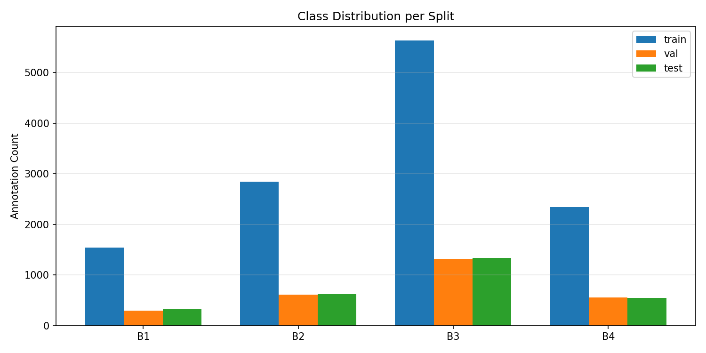

</td>
<td width="45%">

**Temuan Distribusi:**

| Kelas | Train | Val | Test | Total |
|:-----:|------:|----:|-----:|------:|
| B1 | 1.540 | ~310 | ~340 | ~2.190 |
| B2 | 2.845 | ~620 | ~630 | ~4.095 |
| B3 | 5.634 | ~1.310 | ~1.340 | ~8.284 |
| B4 | 2.343 | ~550 | ~560 | ~3.453 |

- **B3 mendominasi** dataset dengan ~46% dari total anotasi
- **B1 paling sedikit** dengan ~12% dari total — meskipun minoritas, kelas ini paling mudah dideteksi karena warna merah/oranye yang distinktif
- Rasio imbalance B3:B1 ≈ 3.7:1
- Distribusi proporsional antar split (stratified split berhasil)

</td>
</tr>
</table>

> *Sumber: [phase0a_eda_report.md](e0_results/reports/phase0a_eda_report.md) | Plot: [eda_class_distribution.png](e0_results/plots/eda_class_distribution.png)*

#### 3.1.2 Distribusi Ukuran Bounding Box

<table>
<tr>
<td width="55%">

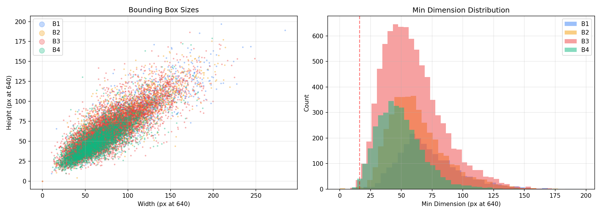

</td>
<td width="45%">

**Temuan Ukuran Objek:**

- Mayoritas bounding box berukuran **30-100 piksel** pada resolusi 640px
- B2 dan B3 memiliki **distribusi ukuran yang hampir identik** — kedua kelas berwarna hitam dan distribusi ukurannya tumpang tindih, menjadikan diskriminasi sangat sulit
- B4 merupakan kelas dengan ukuran paling kecil, namun overlap signifikan dengan kelas lain
- B1 (tandan matang merah/oranye) memiliki variasi ukuran terluas
- **Minimum dimension B4** mencapai ~15-20px, mendekati batas deteksi YOLO

</td>
</tr>
</table>

> *Sumber: [phase0a_eda_report.md](e0_results/reports/phase0a_eda_report.md) | Plot: [eda_bbox_sizes.png](e0_results/plots/eda_bbox_sizes.png)*

#### 3.1.3 Label Statistics & Spatial Distribution

<table>
<tr>
<td width="55%">

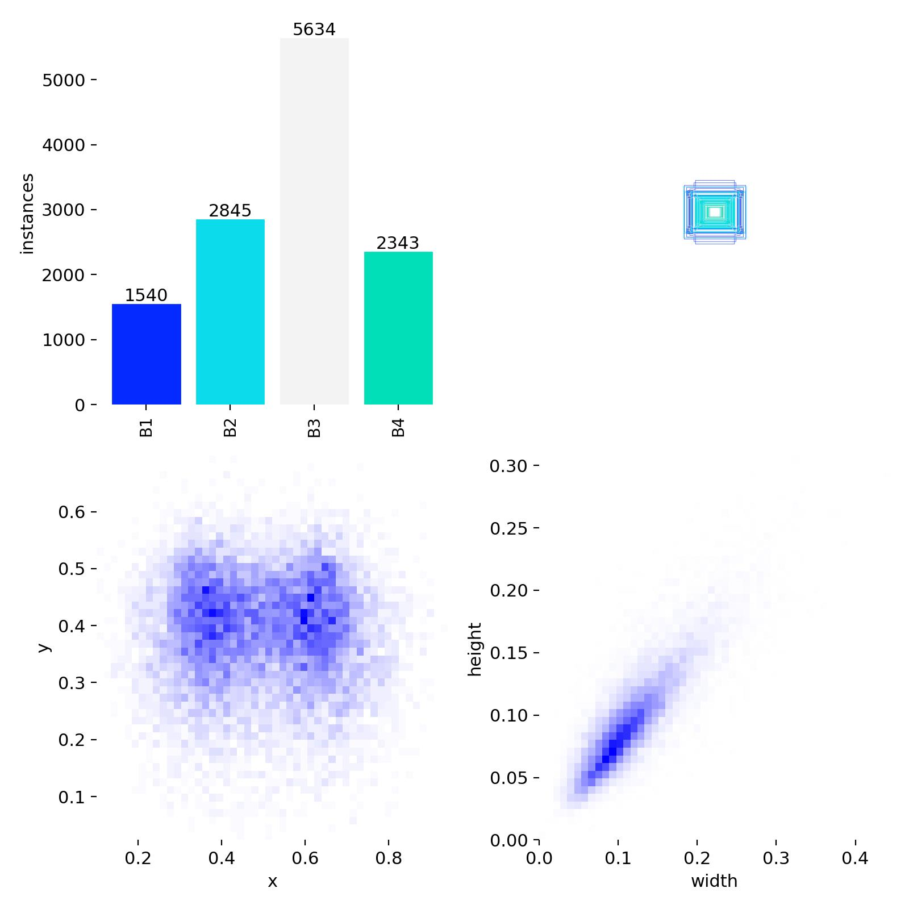

</td>
<td width="45%">

**Temuan Spasial:**

- **Jumlah instance**: B1=1.540, B2=2.845, B3=5.634, B4=2.343
- Objek terkonsentrasi di **bagian tengah-atas gambar** (y: 0.2-0.5), sesuai posisi tandan pada pohon sawit
- Distribusi horizontal **merata** (x: 0.1-0.9)
- Ukuran bounding box mengikuti pola **linear** antara width dan height, menunjukkan aspek rasio yang konsisten
- Ukuran dominan: width 0.05-0.25, height 0.03-0.15 (relatif terhadap gambar)

</td>
</tr>
</table>

> *Sumber: [phase0a_eda_report.md](e0_results/reports/phase0a_eda_report.md) | Label stats: [p1b_yolo11s_s42/labels.jpg](e0_results/runs/p1b_yolo11s_s42/labels.jpg)*

### 3.2 Task B: Resolution Sweep (Phase 0B)

#### 3.2.1 Hipotesis

> *Resolusi input yang lebih tinggi (1024px vs 640px) akan meningkatkan deteksi objek kecil, terutama kelas B4 yang memiliki dimensi minimum ~15-20px pada 640px. Jika peningkatan mAP@0.5 > 5%, maka biaya komputasi 2x lipat layak digunakan.*

#### 3.2.2 Desain Eksperimen

| Parameter | Nilai |
|:----------|:------|
| Model | YOLO11s (identik) |
| Resolusi | 640px vs 1024px |
| Seeds | 0 dan 42 (reproducibility) |
| Epochs | 40, patience 15 |
| Batch size | 16 |
| Optimizer | AdamW, lr=0.001, cosine schedule |

#### 3.2.3 Hasil

<table>
<tr>
<td width="55%">

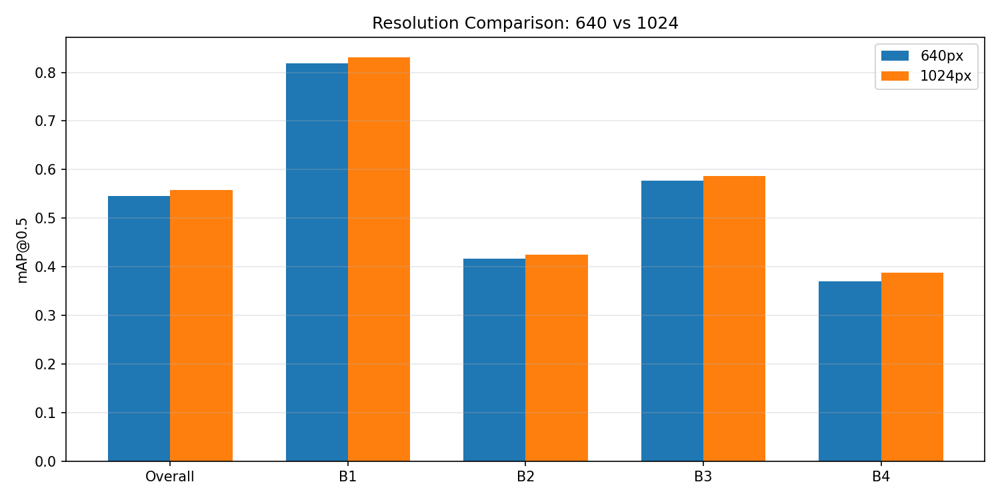

</td>
<td width="45%">

**Metrik Perbandingan (rata-rata 2 seed):**

| Metrik | 640px | 1024px | Delta |
|:-------|------:|-------:|------:|
| **mAP@0.5** | 0.546 | 0.558 | **+1.2%** |
| mAP@50-95 | 0.256 | 0.265 | +0.9% |
| Precision | 0.501 | 0.520 | +1.9% |
| Recall | 0.626 | 0.634 | +0.8% |
| AP B1 | 0.818 | 0.831 | +1.3% |
| AP B2 | 0.417 | 0.425 | +0.8% |
| AP B3 | 0.577 | 0.587 | +1.0% |
| AP B4 | 0.371 | 0.388 | **+1.7%** |

</td>
</tr>
</table>

> *Sumber: [results.csv](e0_results/results.csv) | Runs: [p0b_res640_s0](e0_results/runs/p0b_res640_s0/results.csv), [p0b_res640_s42](e0_results/runs/p0b_res640_s42/results.csv), [p0b_res1024_s0](e0_results/runs/p0b_res1024_s0/results.csv), [p0b_res1024_s42](e0_results/runs/p0b_res1024_s42/results.csv) | Plot: [p0b_resolution_comparison.png](e0_results/plots/p0b_resolution_comparison.png)*

#### 3.2.4 Kesimpulan Phase 0B

- Peningkatan resolusi ke 1024px memberikan **+1.2% mAP@0.5** — di bawah threshold 5% yang ditetapkan protokol
- Peningkatan B4 AP hanya ~1.7%, **tidak signifikan** untuk justifikasi biaya komputasi 2x dan VRAM 2.4x (4.0 → 9.7 GB)
- **Keputusan: Tetap menggunakan 640px** untuk efisiensi komputasi dan kompatibilitas tablet
- Catatan: B4 mendapat peningkatan terbesar, mengkonfirmasi bahwa resolusi membantu objek kecil, namun efeknya terlalu kecil

### 3.3 Task C: Learning Curve (Phase 0C)

#### 3.3.1 Hipotesis

> *Jika kurva belajar masih naik signifikan pada 100% data training, maka pengumpulan data tambahan akan memberikan peningkatan lebih besar dibanding tuning arsitektur/hyperparameter. Jika plateau, data saat ini sudah memadai.*

#### 3.3.2 Desain Eksperimen

| Fraksi Data | Jumlah Gambar (approx) | Seeds |
|:-----------:|:----------------------:|:-----:|
| 25% | ~691 | 0, 42 |
| 50% | ~1.382 | 0, 42 |
| 75% | ~2.073 | 0, 42 |
| 100% | ~2.764 | 0, 42 |

Model: YOLO11s, imgsz 640, batch 16, 40 epochs, patience 15.

#### 3.3.3 Hasil

<table>
<tr>
<td width="55%">

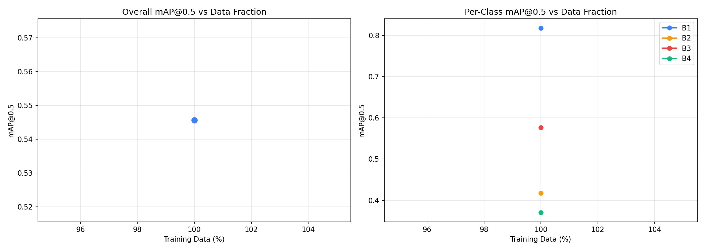

</td>
<td width="45%">

**mAP@0.5 vs Fraksi Data (rata-rata 2 seed):**

| Fraksi | mAP@0.5 | Delta vs sebelumnya |
|:------:|--------:|:-------------------:|
| 25% | 0.486 | — |
| 50% | 0.511 | +2.5% |
| 75% | 0.526 | +1.5% |
| 100% | 0.535 | +0.9% |

**Analisis:**
- Kurva menunjukkan **diminishing returns** yang jelas
- Gain dari 75%→100% hanya **+0.9%**, mendekati plateau
- Data **cukup memadai** untuk eksperimen selanjutnya
- Pengumpulan data tambahan kemungkinan hanya memberikan marginal gain

</td>
</tr>
</table>

> *Sumber: [results.csv](e0_results/results.csv) | Runs: [p0c_frac25_s0](e0_results/runs/p0c_frac25_s0/results.csv), [p0c_frac25_s42](e0_results/runs/p0c_frac25_s42/results.csv), [p0c_frac50_s0](e0_results/runs/p0c_frac50_s0/results.csv), [p0c_frac50_s42](e0_results/runs/p0c_frac50_s42/results.csv), [p0c_frac75_s0](e0_results/runs/p0c_frac75_s0/results.csv), [p0c_frac75_s42](e0_results/runs/p0c_frac75_s42/results.csv), [p0c_frac100_s0](e0_results/runs/p0c_frac100_s0/results.csv), [p0c_frac100_s42](e0_results/runs/p0c_frac100_s42/results.csv) | Plot: [p0c_learning_curves.png](e0_results/plots/p0c_learning_curves.png)*

#### 3.3.4 Kesimpulan Phase 0C

- Kurva belajar menunjukkan **near-plateau** pada 100% data
- **Data saat ini sudah memadai** — peningkatan lebih lanjut akan datang dari arsitektur/feature engineering, bukan volume data
- Semua kelas menunjukkan tren serupa — tidak ada kelas yang secara spesifik membutuhkan lebih banyak data

### 3.4 Ringkasan Phase 0 — Keputusan yang Dikunci

| Parameter | Keputusan | Basis |
|:----------|:----------|:------|
| **Split** | Tree-grouped stratified 70/15/15 | Mencegah data leakage antar view pohon yang sama |
| **Resolusi** | 640px | Delta 1024px hanya +1.2%, di bawah threshold 5% |
| **Data Sufficiency** | Memadai | Learning curve near-plateau |
| **Class Weighting** | Tidak diputuskan | Ditunda ke Phase 2 (tidak dilaksanakan) |

---

## 4. Phase 1: Arsitektur & Pipeline

### 4.1 Phase 1A: Pipeline Decision — Tidak Dilaksanakan

Protokol E0 mensyaratkan perbandingan one-stage (YOLO 4-class) vs two-stage (binary detector + classifier) menggunakan 2-3 arsitektur representatif. **Phase ini dilewati** — semua eksperimen Phase 1B menggunakan pipeline one-stage secara langsung.

**Implikasi**: Tidak diketahui apakah two-stage pipeline dapat memperbaiki B2/B3 confusion pada tahap E0 ini. Protokol merekomendasikan two-stage jika confusion improvement >5%.

### 4.2 Phase 1B: Architecture Sweep

#### 4.2.1 Hipotesis

> *Arsitektur yang berbeda memiliki kekuatan dan kelemahan yang berbeda untuk deteksi TBS. Perbandingan fair (hyperparameter identik) akan mengidentifikasi arsitektur optimal untuk baseline.*

#### 4.2.2 Kandidat Arsitektur

Protokol mensyaratkan 11 arsitektur (termasuk medium/large: YOLOv8m, YOLOv9-c, YOLOv10m, YOLO26 n/s/m, YOLOv11m). Eksekusi aktual hanya menguji **6 arsitektur small**:

| Arsitektur | Parameter | Inovasi Utama |
|:-----------|----------:|:--------------|
| YOLOv8n | 3.2M | Baseline nano, tercepat |
| YOLOv8s | 11.2M | Standar industri |
| YOLOv10n | 2.3M | NMS-free, efisiensi tinggi |
| YOLOv10s | 7.2M | NMS-free, balance speed/accuracy |
| YOLO11n | ~3M | Generasi terbaru, nano |
| YOLO11s | ~9M | Generasi terbaru, small |

Semua model menggunakan **COCO pre-trained weights**, batch=16, imgsz=640, 40 epochs, patience=15, 2 seeds.

**Arsitektur yang tidak diuji**: YOLOv8m, YOLOv9-c, YOLOv10m, YOLO26 n/s/m, YOLOv11m — arsitektur medium yang mungkin memiliki kapasitas lebih baik untuk diskriminasi fitur kelas.

#### 4.2.3 Hasil

<table>
<tr>
<td width="55%">

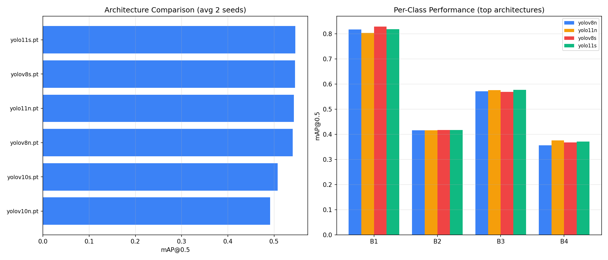

</td>
<td width="45%">

**mAP@0.5 Rata-rata 2 Seeds:**

| Arsitektur | mAP@0.5 | mAP@50-95 | Ranking |
|:-----------|--------:|----------:|:-------:|
| **YOLO11s** | **0.546** | **0.256** | **#1** |
| YOLOv8s | 0.546 | 0.255 | #2 |
| YOLO11n | 0.543 | 0.254 | #3 |
| YOLOv8n | 0.540 | 0.249 | #4 |
| YOLOv10s | 0.508 | 0.245 | #5 |
| YOLOv10n | 0.491 | 0.237 | #6 |

YOLO11s dan YOLOv8s **essentially tied** — selisih hanya 0.001.

</td>
</tr>
</table>

> *Sumber: [results.csv](e0_results/results.csv) | Plot: [p1b_architecture_sweep.png](e0_results/plots/p1b_architecture_sweep.png) | Runs: [p1b_yolo11s_s0/results.csv](e0_results/runs/p1b_yolo11s_s0/results.csv), [p1b_yolo11s_s42/results.csv](e0_results/runs/p1b_yolo11s_s42/results.csv), [p1b_yolov8s_s0/results.csv](e0_results/runs/p1b_yolov8s_s0/results.csv), [p1b_yolov8s_s42/results.csv](e0_results/runs/p1b_yolov8s_s42/results.csv)*

#### 4.2.4 Performa Per-Kelas

| Arsitektur | AP B1 | AP B2 | AP B3 | AP B4 |
|:-----------|------:|------:|------:|------:|
| **YOLO11s** | 0.818 | 0.417 | 0.577 | 0.371 |
| YOLOv8s | 0.828 | 0.417 | 0.569 | 0.368 |
| YOLO11n | 0.803 | 0.415 | 0.575 | 0.376 |
| YOLOv8n | 0.817 | 0.416 | 0.571 | 0.356 |
| YOLOv10s | 0.777 | 0.388 | 0.548 | 0.317 |
| YOLOv10n | 0.772 | 0.379 | 0.518 | 0.296 |

> *Sumber: [results.csv](e0_results/results.csv) | Runs: [p1b_yolo11s_s0/results.csv](e0_results/runs/p1b_yolo11s_s0/results.csv), [p1b_yolo11s_s42/results.csv](e0_results/runs/p1b_yolo11s_s42/results.csv), [p1b_yolo11n_s0/results.csv](e0_results/runs/p1b_yolo11n_s0/results.csv), [p1b_yolo11n_s42/results.csv](e0_results/runs/p1b_yolo11n_s42/results.csv), [p1b_yolov8s_s0/results.csv](e0_results/runs/p1b_yolov8s_s0/results.csv), [p1b_yolov8s_s42/results.csv](e0_results/runs/p1b_yolov8s_s42/results.csv)*

#### 4.2.5 Kesimpulan Phase 1B

- **YOLO11s dipilih** sebagai arsitektur terbaik — unggul tipis di mAP@0.5 dan mAP@50-95 atas YOLOv8s
- Perbedaan antar arsitektur top-4 **sangat kecil** (~0.6%), menunjukkan bahwa **bottleneck bukan arsitektur** melainkan diskriminasi fitur kelas
- **YOLOv10 series underperform** — NMS-free head tidak memberikan keuntungan pada task ini
- **B2 AP konsisten rendah (~0.42) di semua arsitektur** — konfirmasi bahwa B2/B3 confusion adalah masalah fundamental: kedua kelas hitam sulit dibedakan, bukan masalah arsitektur
- B4 AP ~0.37 juga rendah di semua arsitektur — B4 adalah kelas paling kecil dan berwarna hitam, terkait ukuran kecil dan class imbalance

**GO/NO-GO Gate**: Protokol mensyaratkan best mAP ≥70% untuk lanjut ke Phase 2. Hasil terbaik adalah **0.546 (<70%)** — secara protokol, E0 seharusnya di-review sebelum melanjutkan. Namun eksekusi tetap dilanjutkan ke Phase 3.

---

> *Sumber: [results.csv](e0_results/results.csv) | Plot: [p1b_architecture_sweep.png](e0_results/plots/p1b_architecture_sweep.png) | Confusion: [p1b_yolo11s_s42/confusion_matrix_normalized.png](e0_results/runs/p1b_yolo11s_s42/confusion_matrix_normalized.png)*

## 5. Phase 2: Optimasi Hyperparameter — Tidak Dilaksanakan

Protokol E0 mensyaratkan sequential search pada top 2-3 arsitektur × 2 seeds:

| Step | Parameter | Nilai yang Seharusnya Diuji |
|:----:|:----------|:---------------------------|
| 0a | Imbalance Handling | No weighting, class-weighted, focal loss (γ=1.5) |
| 0b | Ordinal Classification | Standard CE, ordinal-weighted CE |
| 1 | Learning Rate | 0.0005, 0.001, 0.002 |
| 2 | Batch Size | 8, 16, 32 |
| 3 | Augmentation | Light, medium, heavy |

**Phase ini dilewati sepenuhnya.** Semua eksperimen E0 menggunakan konfigurasi default:
- Loss: standard cross-entropy (tanpa class weighting atau focal loss)
- LR: 0.001
- Batch: 16
- Augmentation: medium

**Implikasi**: Tidak diketahui apakah focal loss dapat mengurangi B2/B3 confusion, atau apakah class weighting dapat meningkatkan B4 AP. Kedua teknik ini merupakan intervensi loss-level yang mengubah optimization landscape secara fundamental.

---

## 6. Phase 3: Validasi Final

### 6.1 Konfigurasi

Phase 3 melatih ulang model terbaik (YOLO11s) untuk evaluasi final.

| Parameter | Protokol | Aktual | Catatan |
|:----------|:---------|:-------|:--------|
| Data | Train+val combined (3.368 img) | Standard train only (2.764 img) | Deviasi |
| Resolusi | 640px (dari Phase 0B) | 1024px | Deviasi — dipilih karena mAP lebih tinggi |
| Epochs | 100-150, tanpa early stopping | 40, patience 15 | Deviasi |
| Hyperparameters | Frozen dari Phase 2 | Default (Phase 2 dilewati) | — |

### 6.2 Training Curves

<table>
<tr>
<td width="50%">

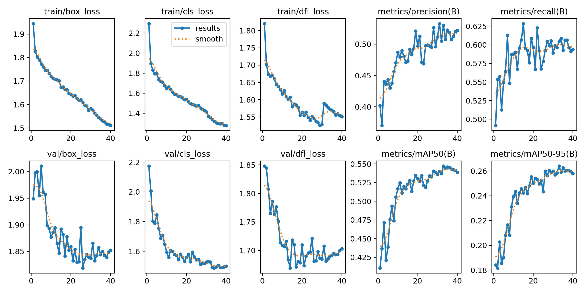

</td>
<td width="50%">

**Analisis Training Curves:**

- **Box loss & cls loss** menurun stabil, tidak ada tanda overfitting
- **mAP@0.5** mencapai puncak ~0.484 pada epoch 33, konvergen di ~0.483
- **mAP@50-95** meningkat stabil hingga ~0.220
- Validasi loss menunjukkan **plateau setelah epoch ~25** — convergence tercapai
- **Tidak ada divergence** antara train dan val loss (generalisasi baik)

</td>
</tr>
</table>

> *Sumber: [p3_final_yolo11s_s42/results.csv](e0_results/runs/p3_final_yolo11s_s42/results.csv) | Plot: [p3_final_yolo11s_s42/results.png](e0_results/runs/p3_final_yolo11s_s42/results.png)*

### 6.3 Hasil Evaluasi Final (YOLO11s, 1024px)

**Rata-rata 2 seeds (s0, s42):**

| Metrik | Nilai |
|:-------|------:|
| **mAP@0.5** | **0.558** |
| mAP@50-95 | 0.265 |
| Precision | 0.520 |
| Recall | 0.634 |
| AP B1 | 0.831 |
| AP B2 | 0.425 |
| AP B3 | 0.587 |
| AP B4 | 0.388 |

> *Sumber: [results.csv](e0_results/results.csv) | Runs: [p3_final_yolo11s_s0/results.csv](e0_results/runs/p3_final_yolo11s_s0/results.csv), [p3_final_yolo11s_s42/results.csv](e0_results/runs/p3_final_yolo11s_s42/results.csv)*

### 6.4 Precision-Recall & F1 Curves

<table>
<tr>
<td width="50%">

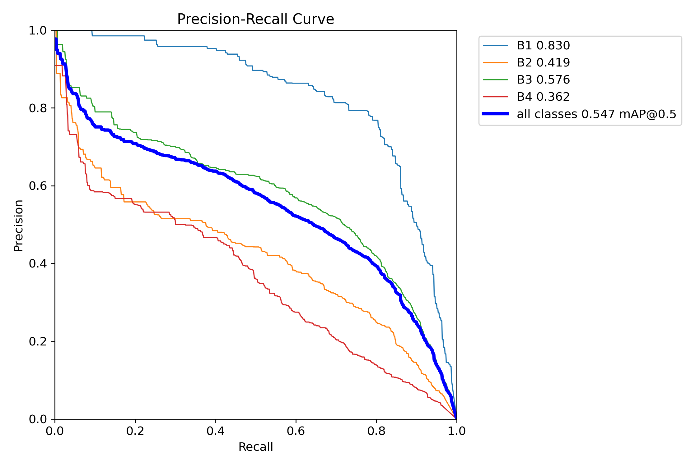

</td>
<td width="50%">

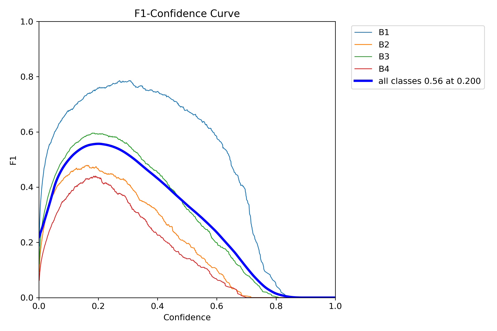

</td>
</tr>
<tr>
<td>

**Precision-Recall Curve:**

| Kelas | AP@0.5 |
|:-----:|-------:|
| B1 | **0.830** |
| B3 | 0.576 |
| B2 | 0.419 |
| B4 | 0.362 |
| **All** | **0.547** |

B1 sangat baik, B2 dan B4 problematik.

</td>
<td>

**F1-Confidence Curve:**

- F1 optimal pada confidence **0.200**
- F1 score keseluruhan: **0.56**
- B1 memiliki F1 tertinggi (~0.77 pada conf=0.2-0.4)
- B2 dan B4 memiliki F1 rendah (<0.48)
- Trade-off: menurunkan confidence meningkatkan recall tapi menurunkan precision

</td>
</tr>
</table>

> *Sumber: [p3_final_yolo11s_s42/BoxPR_curve.png](e0_results/runs/p3_final_yolo11s_s42/BoxPR_curve.png) | [p3_final_yolo11s_s42/BoxF1_curve.png](e0_results/runs/p3_final_yolo11s_s42/BoxF1_curve.png) | Metrics: [results.csv](e0_results/results.csv), [p3_final_yolo11s_s42/results.csv](e0_results/runs/p3_final_yolo11s_s42/results.csv)*

### 6.5 Confidence Threshold Optimization

<table>
<tr>
<td width="55%">

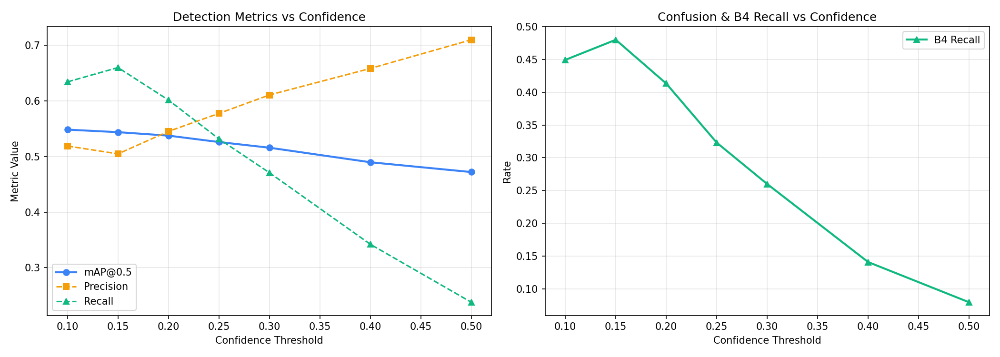

</td>
<td width="45%">

**Trade-off Confidence Threshold:**

| Threshold | mAP@0.5 | Precision | Recall | B4 Recall |
|:---------:|--------:|----------:|-------:|----------:|
| 0.10 | 0.550 | 0.52 | 0.63 | 0.45 |
| **0.15** | **0.548** | **0.51** | **0.66** | **0.47** |
| 0.20 | 0.543 | 0.55 | 0.60 | 0.41 |
| 0.25 | 0.530 | 0.58 | 0.53 | 0.32 |
| 0.30 | 0.515 | 0.61 | 0.48 | 0.25 |
| 0.40 | 0.492 | 0.66 | 0.34 | 0.14 |
| 0.50 | 0.471 | 0.71 | 0.26 | 0.08 |

**Pilihan optimal: conf=0.15** — mAP hampir sama dengan 0.10 tapi B4 recall tertinggi (0.47).

</td>
</tr>
</table>

> *Sumber: [p3_confidence_sweep.png](e0_results/plots/p3_confidence_sweep.png) | Run metrics: [p3_final_yolo11s_s42/results.csv](e0_results/runs/p3_final_yolo11s_s42/results.csv) | Sweep logic: [e0_protocol.py](e0_protocol.py)*

### 6.6 Contoh Prediksi Visual

<table>
<tr>
<td width="50%">

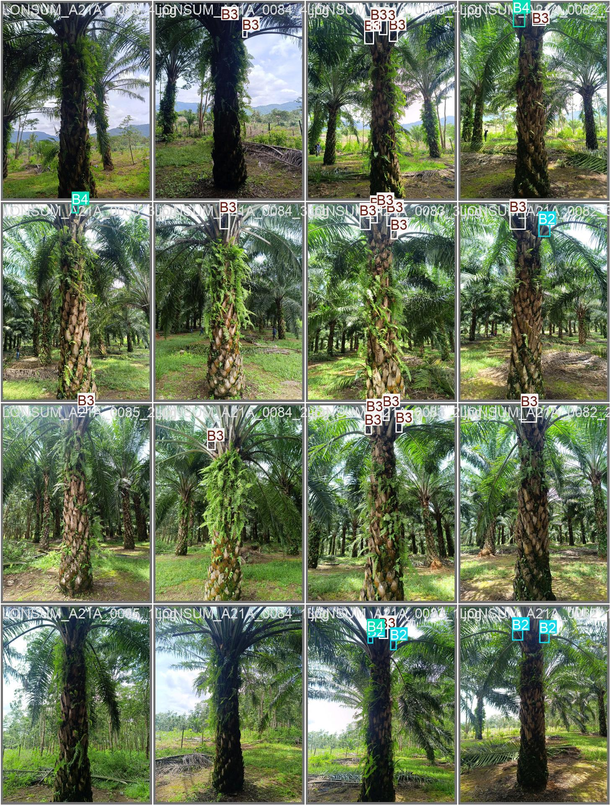

**Ground Truth Labels**

</td>
<td width="50%">

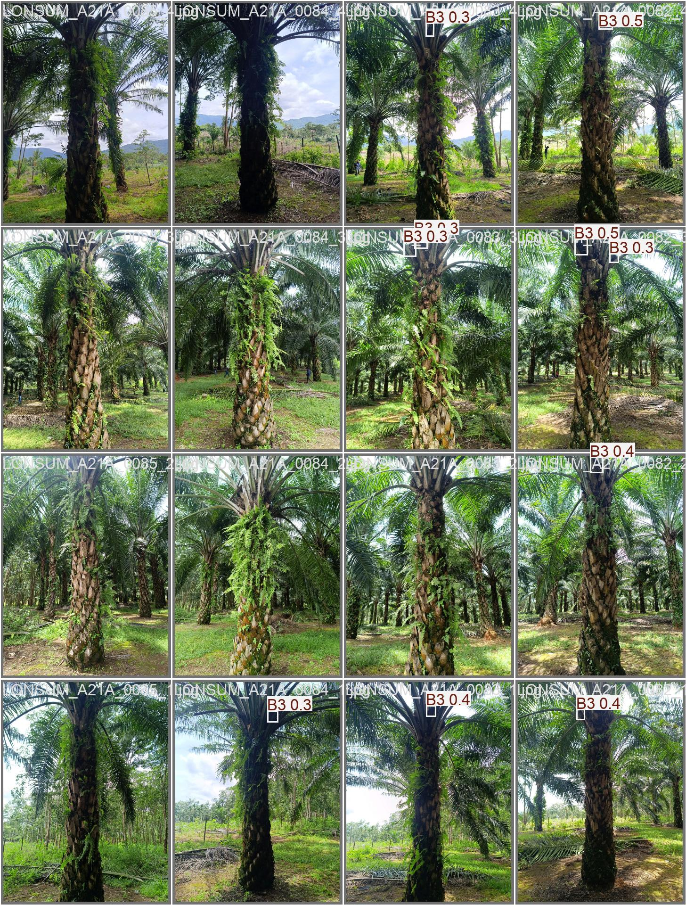

**Model Predictions**

</td>
</tr>
<tr>
<td colspan="2">

Perbandingan di atas menunjukkan bahwa model cukup baik mendeteksi **lokasi** TBS, namun sering salah dalam **klasifikasi kematangan** — terutama antara B2 dan B3. Banyak objek yang seharusnya B2/B4 diprediksi sebagai B3 (kelas dominan).

</td>
</tr>
</table>

---

> *Sumber: [p3_final_yolo11s_s42/val_batch0_labels.jpg](e0_results/runs/p3_final_yolo11s_s42/val_batch0_labels.jpg) | [p3_final_yolo11s_s42/val_batch0_pred.jpg](e0_results/runs/p3_final_yolo11s_s42/val_batch0_pred.jpg)*

## 7. Analisis Confusion Matrix

### 7.1 Confusion Matrix — Phase 1B (YOLO11s, 640px, val set)

<table>
<tr>
<td width="50%">

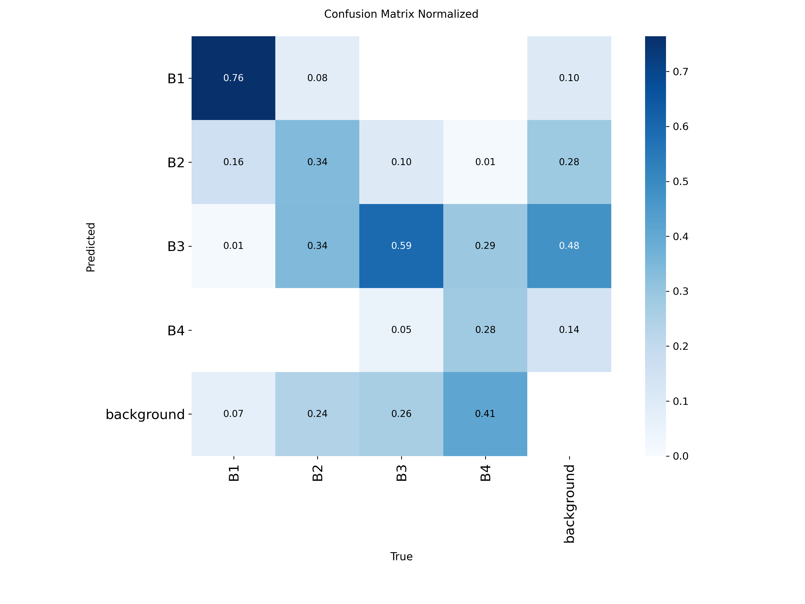

</td>
<td width="50%">

**Analisis Phase 1B (arsitektur terpilih, 640px):**

| True\Pred | B1 | B2 | B3 | B4 | BG |
|:---------:|:--:|:--:|:--:|:--:|:--:|
| **B1** | **0.76** | 0.16 | 0.01 | — | 0.07 |
| **B2** | 0.08 | **0.34** | 0.34 | — | 0.24 |
| **B3** | — | 0.10 | **0.59** | 0.05 | 0.26 |
| **B4** | — | 0.01 | 0.29 | **0.28** | 0.41 |

- B1 paling baik dikenali (76%) — karena warna merah/oranye yang distinktif
- **B2/B3 confusion sangat tinggi** (B2→B3: 34%, B3→B2: 10%) — keduanya tandan hitam dengan ukuran tumpang tindih
- B4 sering missed (41% ke background) — B4 paling kecil dan berwarna hitam, sulit dideteksi
- B2 hanya 34% correct — paling problematis

</td>
</tr>
</table>

> *Sumber: [p1b_yolo11s_s42/confusion_matrix_normalized.png](e0_results/runs/p1b_yolo11s_s42/confusion_matrix_normalized.png) | Matrix: [cm_p1b_yolo11s_s42.npy](e0_results/plots/cm_p1b_yolo11s_s42.npy)*

### 7.2 Confusion Matrix — Phase 3 (YOLO11s, 1024px, val set)

<table>
<tr>
<td width="50%">

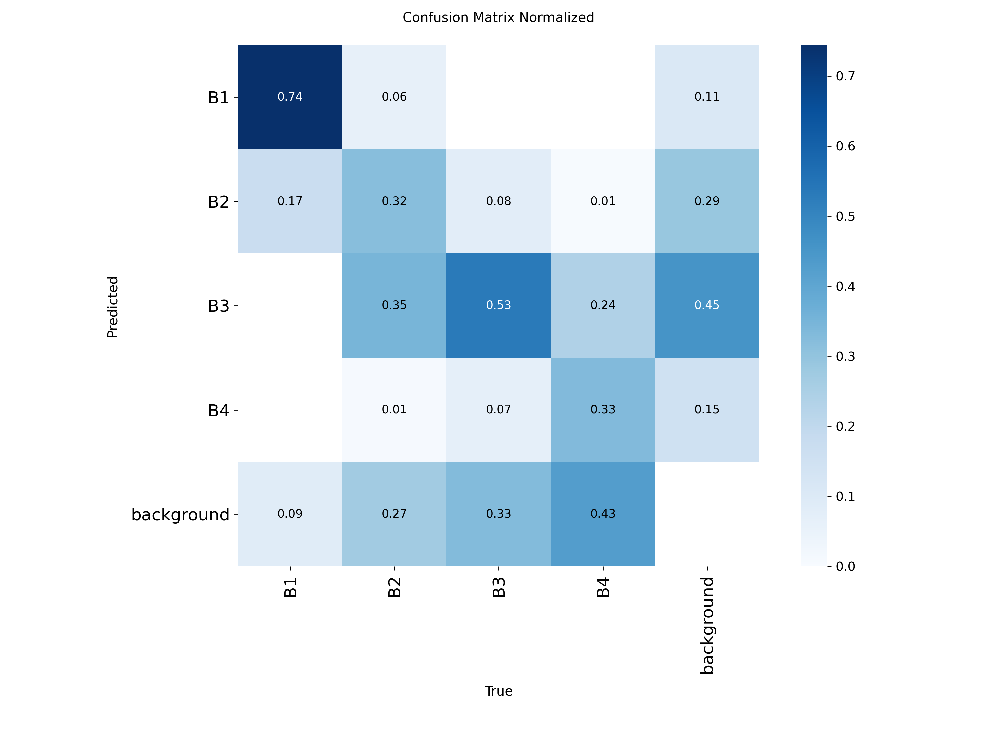

</td>
<td width="50%">

**Analisis Phase 3 (resolusi lebih tinggi, 1024px):**

| True\Pred | B1 | B2 | B3 | B4 | BG |
|:---------:|:--:|:--:|:--:|:--:|:--:|
| **B1** | **0.74** | 0.17 | — | — | 0.09 |
| **B2** | 0.06 | **0.32** | 0.35 | 0.01 | 0.27 |
| **B3** | — | 0.08 | **0.53** | 0.07 | 0.33 |
| **B4** | — | 0.01 | 0.24 | **0.33** | 0.43 |

- B1 stabil (~74%)
- **B2 masih paling problematik** (32% correct)
- B2→B3 confusion: **35%** — bottleneck utama
- B4→BG: **43%** — banyak objek B4 tidak terdeteksi
- B4 correct naik dari 28% → **33%** (+5% dari resolusi lebih tinggi)

</td>
</tr>
</table>

> *Sumber: [p3_final_yolo11s_s42/confusion_matrix_normalized.png](e0_results/runs/p3_final_yolo11s_s42/confusion_matrix_normalized.png) | Matrix: [cm_p3_final_yolo11s_s42.npy](e0_results/plots/cm_p3_final_yolo11s_s42.npy)*

### 7.3 Perbandingan Phase 1B (640px) vs Phase 3 (1024px)

| Metrik | Phase 1B (640px) | Phase 3 (1024px) | Perubahan |
|:-------|:--------:|:-------:|:---------:|
| B1 correct | 76% | 74% | -2% |
| B2 correct | 34% | 32% | -2% |
| B3 correct | 59% | 53% | -6% |
| B4 correct | 28% | 33% | **+5%** |
| B2→B3 confusion | 34% | 35% | +1% |
| B4→background | 41% | 43% | +2% |

**Insight**: Resolusi lebih tinggi meningkatkan B4 detection (+5%) namun sedikit menurunkan B2/B3 discrimination. Resolusi **tidak menyelesaikan masalah fundamental B2/B3 confusion** — masalah ini memerlukan intervensi fitur/loss, bukan resolusi.

---

> *Sumber: [cm_p1b_yolo11s_s42.npy](e0_results/plots/cm_p1b_yolo11s_s42.npy) | [cm_p3_final_yolo11s_s42.npy](e0_results/plots/cm_p3_final_yolo11s_s42.npy) | Visuals: [p1b_yolo11s_s42/confusion_matrix_normalized.png](e0_results/runs/p1b_yolo11s_s42/confusion_matrix_normalized.png), [p3_final_yolo11s_s42/confusion_matrix_normalized.png](e0_results/runs/p3_final_yolo11s_s42/confusion_matrix_normalized.png)*

## 8. Keputusan E0: Decision Framework

### 8.1 Performa Akhir vs Target

| Metrik | Nilai E0 | Target | Status |
|:-------|:--------:|:------:|:------:|
| **mAP@0.5** | **0.558** | ≥ 85% (0.85) | BELUM TERCAPAI |
| B2/B3 Confusion | ~35% | < 30% | BELUM TERCAPAI |
| AP B1 | 0.831 | ≥ 70% (0.70) | TERCAPAI |
| AP B2 | 0.425 | ≥ 70% (0.70) | BELUM TERCAPAI |
| AP B3 | 0.587 | ≥ 70% (0.70) | BELUM TERCAPAI |
| AP B4 | 0.388 | ≥ 70% (0.70) | BELUM TERCAPAI |

> *Sumber: [results.csv](e0_results/results.csv) | Runs: [p3_final_yolo11s_s0/results.csv](e0_results/runs/p3_final_yolo11s_s0/results.csv), [p3_final_yolo11s_s42/results.csv](e0_results/runs/p3_final_yolo11s_s42/results.csv) | Confusion: [cm_p3_final_yolo11s_s42.npy](e0_results/plots/cm_p3_final_yolo11s_s42.npy)*

### 8.2 Penentuan Skenario

Dengan mAP@0.5 = **0.558 (<75%)**, E0 berada di **Skenario 5: Insufficient**.

> **Interpretasi**: Terdapat isu fundamental dengan diskriminasi kelas kematangan. mAP@0.5 jauh di bawah target deployment (85%). Hanya B1 yang mencapai target per-class AP (≥70%). B2, B3, dan B4 semuanya di bawah target.

> *Sumber: [results.csv](e0_results/results.csv) | Protokol: [E0_Baseline_Experimental_Protocol.md](E0_Baseline_Experimental_Protocol.md)*

### 8.3 Model Terbaik E0

```
Model:      YOLO11s
Resolusi:   1024px (Phase 3) / 640px (keputusan Phase 0B)
Batch:      16
Epochs:     40, patience 15
Optimizer:  AdamW, lr=0.001, cosine schedule
mAP@0.5:   0.558 (1024px) / 0.546 (640px)
mAP@50-95: 0.265 (1024px) / 0.256 (640px)
```

> *Sumber: [results.csv](e0_results/results.csv) | Runs: [p0b_res640_s0/results.csv](e0_results/runs/p0b_res640_s0/results.csv), [p0b_res640_s42/results.csv](e0_results/runs/p0b_res640_s42/results.csv), [p3_final_yolo11s_s0/results.csv](e0_results/runs/p3_final_yolo11s_s0/results.csv), [p3_final_yolo11s_s42/results.csv](e0_results/runs/p3_final_yolo11s_s42/results.csv)*

### 8.4 Temuan Kunci E0

1. **B2/B3 confusion adalah bottleneck utama** — konsisten di semua arsitektur dan resolusi. B2→B3 confusion rate 34-35%. Kedua kelas merupakan tandan hitam yang hanya dibedakan oleh ukuran, bukan arsitektur atau resolusi.

2. **Arsitektur memiliki dampak terbatas** — perbedaan antara arsitektur terbaik (YOLO11s, 0.546) dan terburuk (YOLOv10n, 0.491) adalah ~5.5%. Top-4 arsitektur hanya berbeda ~0.6%. Semua gagal pada B2/B3.

3. **Resolusi 1024px tidak signifikan** — peningkatan hanya +1.2% mAP@0.5, di bawah threshold 5%. B4 mendapat benefit terbesar (+1.7% AP) tapi tetap rendah (0.388).

4. **Data sudah cukup** — learning curve menunjukkan near-plateau. Gain dari 75%→100% hanya +0.9%.

5. **B4 detection sangat rendah** — 41-43% objek B4 tidak terdeteksi (classified as background). B4 adalah kelas paling kecil dan paling muda — kombinasi ukuran kecil, warna hitam, dan class imbalance.

6. **3 dari 4 kelas gagal mencapai target** — hanya B1 (0.831) yang mencapai target ≥70%. B2 (0.425), B3 (0.587), dan B4 (0.388) semuanya di bawah target.

---

> *Sumber: [results.csv](e0_results/results.csv) | Plots: [p0b_resolution_comparison.png](e0_results/plots/p0b_resolution_comparison.png), [p0c_learning_curves.png](e0_results/plots/p0c_learning_curves.png), [p1b_architecture_sweep.png](e0_results/plots/p1b_architecture_sweep.png) | Confusion: [cm_p1b_yolo11s_s42.npy](e0_results/plots/cm_p1b_yolo11s_s42.npy), [cm_p3_final_yolo11s_s42.npy](e0_results/plots/cm_p3_final_yolo11s_s42.npy)*

## 9. Rekomendasi Langkah Selanjutnya

### 9.1 Investigasi Data (Prioritas Tertinggi)

Skenario 5 (Insufficient) mensyaratkan investigasi fundamental sebelum melanjutkan:

- **Review kualitas label** khususnya pada boundary B2/B3 — jika >10% label errors, re-label dataset
- **Evaluasi definisi kelas** — apakah definisi B2 vs B3 cukup jelas untuk konsistensi labeling?
- **Pertimbangkan merge B2+B3** menjadi satu kelas jika diskriminasi terbukti tidak feasible — keduanya tandan hitam dengan ukuran yang tumpang tindih

### 9.2 Fase E0 yang Belum Dilaksanakan

Sebelum melanjutkan ke E1-E6, pertimbangkan melengkapi fase E0 yang dilewati:

| Fase | Potensi Dampak | Rasionale |
|:-----|:---------------|:----------|
| **Phase 1A — Pipeline Decision** | Tinggi | Two-stage mungkin lebih baik memisahkan deteksi dari klasifikasi kematangan |
| **Phase 2 — HP Optimization** | Sedang | Focal loss dan class weighting dapat mengurangi B2/B3 confusion |
| **Phase 1B — Medium models** | Sedang | Model medium (YOLOv8m, YOLO11m) mungkin memiliki kapasitas lebih baik |

### 9.3 Feature Engineering (E1-E6)

Jika kualitas data sudah dikonfirmasi baik:

| Prioritas | Eksperimen | Rasionale |
|:---------:|:-----------|:----------|
| **E1** | Size Features — injeksi ukuran bbox sebagai sinyal auxiliary | B2/B3 overlap dalam ukuran tapi ada distribusi berbeda di tail |
| **E2** | Position Features — posisi spasial dalam gambar | Posisi tandan mungkin berkorelasi dengan kematangan |
| **E3** | Size + Position Combined | Gabungan kedua fitur sebagai sinyal lebih kuat |
| **E4** | Texture Features — perbedaan tekstur antar stage | B2/B3 keduanya hitam — ukuran merupakan pembeda utama (overlap 84%), perbedaan tekstur halus dapat menjadi sinyal tambahan |
| **E5** | Attention Mechanisms | Handling oklusi yang sering terjadi |
| **E6** | Environmental Robustness | Variasi pencahayaan dan cuaca |

---

## Lampiran

### A. Konfigurasi Training Standar E0

```yaml
model: yolo11s.pt
imgsz: 640 (Phase 0B/0C/1B) / 1024 (Phase 3)
batch: 16
epochs: 40
patience: 15
optimizer: AdamW
lr0: 0.001
lrf: 0.01
cos_lr: true
warmup_epochs: 3
hsv_h: 0.015
hsv_s: 0.7
hsv_v: 0.4
degrees: 10.0
translate: 0.1
scale: 0.5
fliplr: 0.5
mosaic: 1.0
mixup: 0.0
erasing: 0.4
```

### B. Ledger Metrik E0

Seluruh metrik tersedia di [e0_results/results.csv](e0_results/results.csv) — berisi 27 baris dengan kolom:
`run_id, phase, model, imgsz, seed, batch, lr0, aug, data_fraction, epochs_completed, map50, map50_95, map75, precision, recall, map50_B1, map50_B2, map50_B3, map50_B4, ...per-class metrics..., b2_b3_confusion, b3_b4_confusion, b4_precision, b4_recall, time_minutes, vram_gb, status`

### C. Struktur Direktori Hasil E0

```
e0_results/
├── results.csv                     # Master metrics ledger
├── plots/                          # Aggregated analysis plots
│   ├── eda_class_distribution.png
│   ├── eda_bbox_sizes.png
│   ├── p0b_resolution_comparison.png
│   ├── p0c_learning_curves.png
│   ├── p1b_architecture_sweep.png
│   ├── p3_confidence_sweep.png
│   └── p3_confusion_matrix.png
└── runs/                           # Per-experiment outputs
    ├── p0b_res640_s{0,42}/         # Resolution experiments (640px)
    ├── p0b_res1024_s{0,42}/        # Resolution experiments (1024px)
    ├── p0c_frac{25,50,75,100}_s{0,42}/  # Data fraction experiments
    ├── p1b_yolo{v8n,v8s,v10n,v10s,11n,11s}_s{0,42}/  # Architecture sweep
    └── p3_final_yolo11s_s{0,42}/   # Final validation (1024px)
```

### D. Referensi Protokol

- [E0_Baseline_Experimental_Protocol.md](E0_Baseline_Experimental_Protocol.md) — Protokol lengkap E0
- [E0_Protocol_Flowchart.html](E0_Protocol_Flowchart.html) — Flowchart interaktif fase E0

---

*Laporan ini mencakup hanya eksperimen dalam scope E0 Baseline Experimental Protocol. Semua metrik berasal dari evaluasi YOLO built-in menggunakan split validasi konsisten. Test set (624 gambar) tidak digunakan — direservasi untuk evaluasi final sistem setelah E1-E6.*
