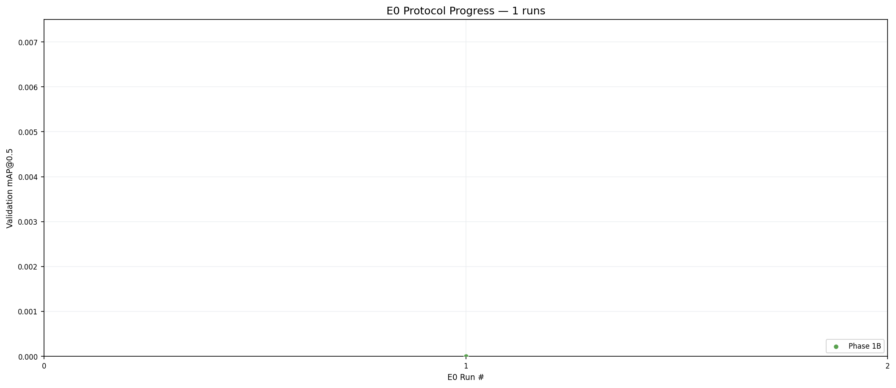

# autoresearch

## E0 Baseline Protocol Progress



> E0 is the automated baseline sweep (resolution, learning curve, architecture, hyperparameter). Results unlock techniques for the E1+ agent research track.

## Agent Research Progress (E1+)


BBC Autoresearch: an AI agent runs hypothesis-driven research for 4-class oil palm fruit bunch detection, proposing and testing novel techniques (architecture changes, feature engineering, pipeline restructuring, custom losses).

The primary decision metric is `mAP@0.5`.

## File Structure

```text
# FROZEN — agent cannot modify
prepare.py              data loading, splitting, evaluation, metrics
orchestrator.py         experiment state, compilation gate, guardrails, logging

# AGENT-EDITABLE
modeling.py             model modifications, custom heads, feature branches, losses
pipeline.py             pipeline structure, stage orchestration, augmentation, inference
train.py                hyperparameters at top, wires pipeline + modeling

# HUMAN-EDITABLE
program.md              agent instructions, guardrails, coding patterns appendix
context/                research_overview.md, domain_knowledge.md, e0_results.md

# GENERATED
experiments/
  state.json            baselines, experiment counter, branch status
  log.md                full experiment log
  summary.md            agent's distilled research notebook
  results.tsv           structured metrics ledger
  batch_NNN_report.md   human-facing batch summary

logs/                   raw timestamped training output
plot_progress.py        regenerate progress.png from results.tsv
progress.png            visual progress chart
archive/                non-default historical material
```

Datasets and generated training outputs under `runs/` are local-only artifacts.

## Quick Start

```bash
uv sync
uv run prepare.py
uv run train.py
```

## Commands

```bash
# Run one experiment
uv run train.py

# Override a decision
uv run orchestrator.py decide <exp_id> <KEEP|DISCARD|PARK> <justification>

# Advance to next batch
uv run orchestrator.py next-batch

# Regenerate progress chart
uv run python plot_progress.py
```

## Operating Rules

- Edit `train.py` for normal experiments (hyperparameter changes → main track)
- Edit `modeling.py` for model changes (custom heads, losses → exploration track)
- Edit `pipeline.py` for pipeline changes (two-stage, augmentation → exploration track)
- Do not edit `prepare.py` or `orchestrator.py` during normal agent operation
- Every experiment requires a title, hypothesis, and success criterion
- Decision metric: mAP@0.5 for keep/discard; analyze all metrics for insight
- Seeds: 42 for regular experiments, 123 for confirmation reruns

## Dataset

Standard YOLO structure:

```text
Dataset-YOLO/
  data.yaml
  images/{train,val,test}
  labels/{train,val,test}
```

4 classes: B1 (unripe), B2 (underripe), B3 (ripe), B4 (overripe)

## Analysis

Use `archive/analysis.ipynb` for ad hoc inspection. Regenerate `progress.png` with `uv run python plot_progress.py`.
